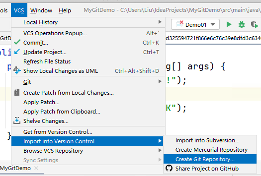
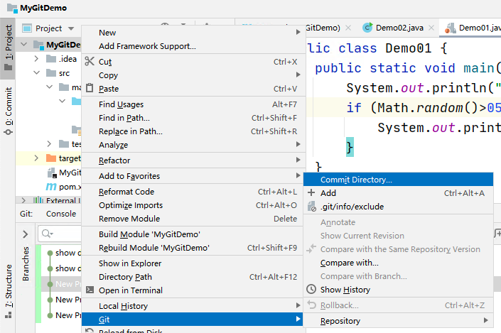
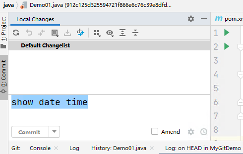
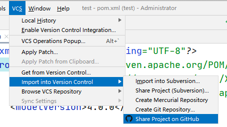

# Git

https://git-scm.com/

Git 是版本管理工具，配置管理工具

核心目的管理软件的源代码，管理软件的版本。

Git 是 Linux 的作者，看到SVN、CVS不好用，另外开发的一套版本管理软件。

Git 在 Linux 是内嵌的！

## Git Windows 需要安装软件

下载Windows版本安装，建议安装64位版本

## Git 概念

1. 仓库Repository：存储代码的文件夹
2. 本地仓库：Local Repository 
3. 远程仓库：Remote Repository

Git 的优点：

1. 利用Git，可以记录每次提交的软件修改情况，可以找回任何一次修改结果，即便是删除操作，可以找回删除的数据。
2. 利用Git 远程仓库，可以实现版本的备份和项目的多人协作

## 在IDEA中使用Git

1. 创建项目 ...

2. 创建Git本地仓库

   

   3. 将项目提交到本地仓库

      

      请务必添加一个信息，点击 Commit 按钮就可以了

      

##  将项目推送到GitHub

1. 创建GitHub的账号 ...

   1. 使用email注册
   2. 需要验证邮箱！

2. 分享项目到GitHub

   1. 
   2. 登录，就可以分享了

   

